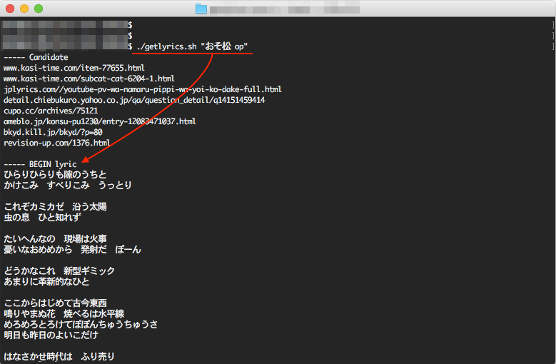

# バシュっと歌詞のテキストデータを取得できる bash スクリプト

## Description
これは、国内外の幾つかの歌詞表示サイトからテキストな歌詞データを取得する bash スクリプトです。スクリプトは PNG に埋め込みました。埋め込んだスクリプトはワンライナーで取り出すことができます。暇だったら挑戦してみてください。

まだ洋楽には弱いです。今後対応します。



## Question 1
- version 1, このバージョンでは、引数に歌詞サイトの URL を与えると歌詞データを取得します。
```
% this_script "URL"
```


## Question 2
- version 2, このバージョンでは、引数に曲タイトルやタイトルの一部を与えると歌詞データを取得します。上記スクショをご参照ください。
```
$ this_script "楽曲タイトルの一部"
or
$ this_script "楽曲タイトルの一部 キーワード など 空白で区切る"
```


## Answer
ver1 も ver2 も同じワンライナーで取り出せます。答えはいつか書きます。

## License
Copyright (c) 2016 tkumata

This software is release under the MIT License, please see [MIT](http://opensource.org/licenses/mit-license.php)

## Author
[tkumata](https://github.com/tkumata)
